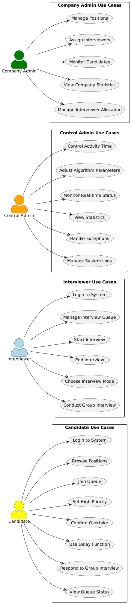
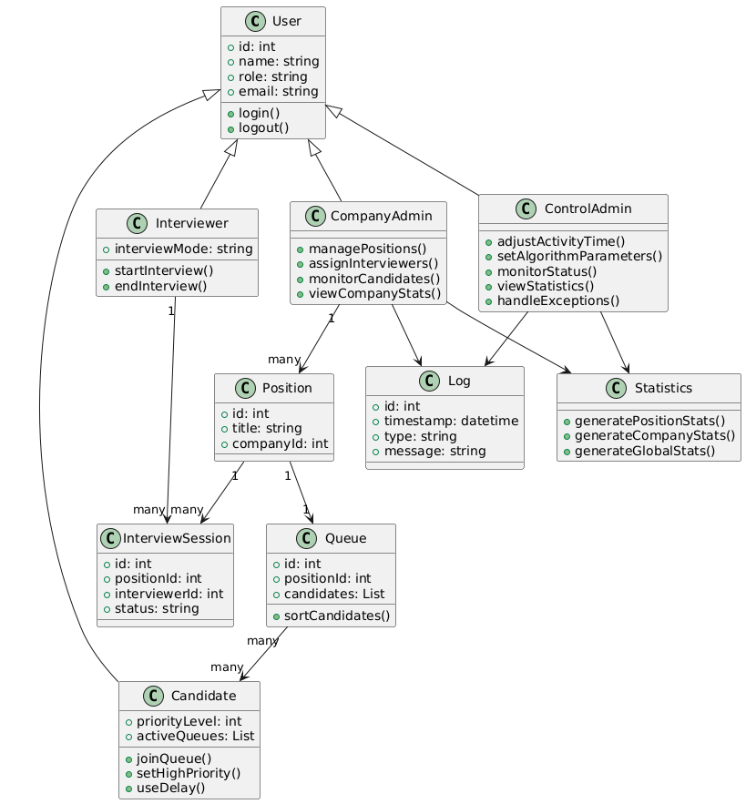
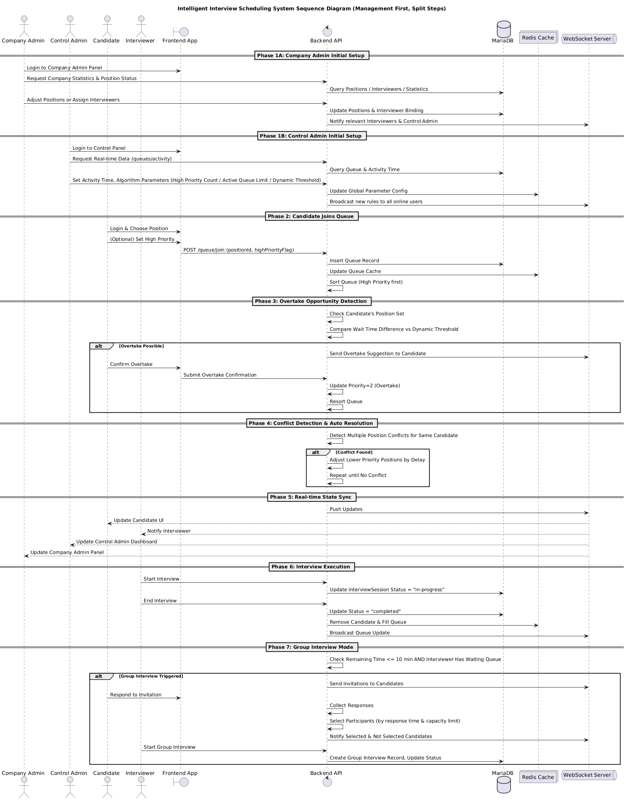

# Intelligent Interview Scheduling System

An intelligent interview scheduling management system based on Go backend and React frontend, supporting multi-role users, dynamic queue management, automatic conflict resolution, and real-time data monitoring.
The source code for this project is hosted on GitHub:  
[GitHub Repository](https://github.com/peach003/One-NZ-project---for-SOT)

## Table of Contents

- [Project Overview](#project-overview)
- [Technology Stack](#technology-stack)
- [Detailed Functionality](#detailed-functionality)
- [System Design Diagrams](#system-design-diagrams)
- [Known Limitations](#known-limitations)
- [Future Improvements](#future-improvements)

## Project Overview

The Intelligent Interview Scheduling System is a comprehensive management platform designed for large-scale recruitment activities. It optimizes interview processes through intelligent algorithms, improves interview efficiency, and enhances candidate experience. The system supports advanced features such as high-priority mechanisms, dynamic queue jumping, and automatic conflict resolution.

### Core Features

- **Intelligent Queue Algorithm** - Dynamic sorting based on priority and time weights
- **High Priority Mechanism** - Candidates can set important positions to enjoy priority
- **Automatic Queue Jumping Optimization** - Intelligent detection and suggestion of queue jumping opportunities
- **Automatic Conflict Resolution** - Fully automated time conflict detection and adjustment
- **Real-time Data Synchronization** - WebSocket real-time updates for all user interfaces
- **Multi-role Management** - Differentiated interfaces for candidates, interviewers, and administrators

## Technology Stack

### Frontend
- **React 18+** - Modern frontend framework
- **TypeScript 5.0+** - Type-safe development
- **WebSocket** - Real-time bidirectional communication
- **Ant Design** - UI component library

### Backend
- **Go 1.21+** - High-performance backend language
- **Gin** - Lightweight HTTP framework
- **GORM** - ORM database operations
- **JWT** - User authentication and authorization
- **Gorilla WebSocket** - WebSocket support

### Data Storage
- **MariaDB 15.1** - Main database
- **Redis 6.0+** - Cache and session storage

### Deployment
- **Apache2** - Web server and reverse proxy
- **systemd** - Service process management

## Detailed Functionality

### 1. Intelligent Queue System

#### High Priority Mechanism Implementation Logic

**Core Principles**:
- Each candidate has a limited number of high priority uses (default 2, configurable 1-4)
- High priority positions enjoy absolute priority in the corresponding position queue
- High priority candidates are sorted by setting time (first set ranks first)
- Non-high priority candidates are sorted by queue join time

**Implementation Steps**:
1. Candidate selects position and clicks "Set as High Priority"
2. System checks high priority count limit and time restriction (prohibited 30 minutes before end)
3. After confirmation, record high priority setting timestamp
4. Trigger position queue reordering
5. Push ranking changes to all related users in real-time

**Core Sorting Algorithm Logic**:
- First group by high priority status
- High priority users internally sorted by setting time
- Regular users sorted by queue join time
- Ensure high priority users always rank before regular users

#### Active Queue Management

**Management Logic**:
- Control administrators can set active queue limit (4-10 adjustable)
- High priority positions force entry into active queue, even if exceeding limit
- Regular positions compete for remaining positions based on comprehensive scores
- Automatic backfill after interview completion

**Comprehensive Scoring Algorithm Principles**:
- Base score determined by priority: High Priority=3, Jump Ahead=2, Regular=1
- Time decay factor: longer wait time, lower score
- Baseline wait time set to 10 minutes, time weight 0.2
- Final score = Priority score - (Actual wait time/Baseline time) × Time weight

### 2. Dynamic Queue Jumping System

#### Queue Jumping Detection Logic

**Detection Conditions**:
- Candidate must have a high priority position as jump source
- Target position must be a regular position
- Meet dynamic threshold condition: High priority wait time - Regular wait time ≥ Dynamic threshold
- Target position has not used queue jumping before

**Dynamic Threshold Calculation**:
- Dynamic threshold = Average interview time + Buffer time
- Example: 8 minutes interview time + 5 minutes buffer = 13 minutes threshold
- Control administrators can adjust these two parameters in real-time
- All queue jumping and conflict detection use the same threshold for consistency

**Queue Jumping Detection Process**:
1. Candidate joins new queue or existing queue status changes
2. System scans all candidate position combinations
3. For each high priority position, check if it can jump ahead for other regular positions
4. Calculate time savings from queue jumping
5. If threshold condition is met, push queue jumping suggestion to candidate
6. After candidate confirmation, execute queue jumping, update priority to "Jump Ahead" (value 2)

#### Queue Jumping Confirmation and Execution

**Confirmation Mechanism**:
- Display queue jumping details: time saved, new estimated interview time
- User manual confirmation to prevent misoperation
- Irreversible after confirmation

**Execution Process**:
1. Update application status to queue jumping used
2. Record queue jumping confirmation time and time saved
3. Set queue jumping priority (value 2)
4. Recalculate queue rankings
5. Detect and resolve possible new conflicts
6. Push updates to all related users

### 3. Automatic Conflict Resolution System

#### Conflict Detection Algorithm

**Detection Logic**:
- Use the same dynamic threshold to detect time conflicts
- Judge as conflict when time difference between two interviews is less than dynamic threshold
- Consider interview duration and buffer time
- Support many-to-many conflict detection

**Detection Scope**:
- Only detect different position applications for the same candidate
- Cover all positions in active queue
- Real-time triggered detection, no scheduled tasks needed

#### Three-layer Priority Resolution Mechanism

**Priority Order**:
1. **First Layer: High Priority Positions (Priority 3)** - Absolute priority, time not adjusted
2. **Second Layer: Jump Ahead Positions (Priority 2)** - Sorted by time saved, more time saved has priority
3. **Third Layer: Regular Positions (Priority 1)** - Lowest priority, preferentially time-adjusted

**Resolution Strategy**:
- High priority positions maintain scheduled time
- Low priority positions delayed until after high priority ends
- Special handling rules within same priority level
- Delay time = High priority end time + Buffer time

#### Cyclic Resolution Algorithm

**Cyclic Mechanism**:
- Maximum cycles = Active queue limit + 1 (prevent infinite loops)
- Resolve all detected conflicts each round
- Re-detect if new conflicts arise
- Continue until no conflicts or maximum rounds reached

**Algorithm Guarantees**:
- Ensure algorithm convergence, avoid infinite loops
- Record resolution process for tracking and debugging
- Use fallback strategy on failure, cancel some queue jumping

### 4. Real-time Synchronization Mechanism

#### WebSocket Connection Management

**Connection Manager Functions**:
- Maintain mapping from user ID to WebSocket connection
- Handle connection establishment, disconnection, and reconnection
- Support concurrent connection management
- Provide heartbeat detection and connection status monitoring

**Message Push Strategy**:
- Queue status changes: Push to all candidates and interviewers of related positions
- Parameter adjustments: Push to all online users
- Queue jumping suggestions: Push to specific candidates
- Interview start/end: Push to candidates and interviewers

#### Status Synchronization Implementation

**Push Timing**:
- Join queue, set high priority, confirm queue jumping
- Conflict resolution, interview start/end
- Parameter adjustments, system status changes

**Message Format Design**:
- Unified message structure: type, timestamp, data
- Version control ensures compatibility
- Compression and optimization reduce bandwidth usage

### 5. Time Control System

#### Activity Phase Management

**State Machine Design**:
- Preparing: All functions disabled, show countdown
- In Progress: Full functionality open
- 10-minute Warning: Stop new users from joining queue
- 5-minute Warning: Trigger group interview mode selection
- Ended: Clear queue, disable operations

**Phase Control Logic**:
- Auto trigger status transitions based on remaining time
- Different phases correspond to different operation permissions
- Smooth transitions, avoid sudden interruptions

#### High Priority Time Restriction

**Restriction Implementation**:
- Prohibit setting new high priority 30 minutes before activity end
- Frontend real-time check and disable related buttons
- Already set high priority unaffected by time restrictions
- Proactive reminders to candidates when approaching deadline

### 6. Group Interview Automation System

#### Trigger Condition Detection

**Trigger Logic**:
- Remaining time ≤ 10 minutes and interviewer has waiting queue
- When interviewer is currently interviewing, wait for current interview to proceed ≥ 5 minutes
- Trigger immediately when interviewer is idle
- System automatic detection, no manual intervention needed

#### Group Interview Invitation and Screening

**Invitation Process**:
1. Create group interview record, set maximum participants
2. Send invitations to all waiting candidates
3. Set 60-second response time limit
4. Collect candidate responses

**Intelligent Screening Algorithm**:
- All selected if response count doesn't exceed limit
- Sort by response time if exceeding limit
- First N selected, rest not selected
- Timely notification of selected and unselected results
- Support substitute mechanism for temporary withdrawals

## System Design Diagrams

### Use Case Diagram

### Class Diagram

### Sequence Diagram 

## Known Limitations

### Core Business Limitations

 **Algorithm complexity increases significantly with queue scale growth**
- Lack of manual intervention mechanism to handle special situations

### System Performance Limitations

#### Algorithm Efficiency Issues
- O(n²) complexity of conflict detection causes performance degradation in large-scale scenarios

#### Data Processing Limitations
- Query performance gradually declines as historical data accumulates
- Lack of effective data pagination and caching strategies
- Large amounts of real-time updates may cause database lock contention

### User Experience Limitations

#### Insufficient Mobile Support
- Interface not optimized for mobile devices
- Touch operation experience needs improvement
- Poor user experience when network is unstable

## Future Improvements

### Performance Optimization

#### Database Performance Enhancement ####
   - Add key query indexes to optimize queue query performance
   - Implement connection pool configuration optimization to reduce database connection overhead
   - Introduce query caching to cache frequently accessed queue status data

#### Algorithm Optimization ####
   - Optimize conflict detection algorithm to reduce unnecessary calculations
   - Add algorithm execution time monitoring with timeout protection
   - Implement incremental update mechanism to avoid full recalculation

#### Caching Strategy ####
   - Use Redis to cache queue status and user sessions
   - Implement multi-layer caching architecture to reduce database pressure
   - Add cache invalidation mechanism to ensure data consistency

### User Experience Improvements

#### Interface Responsiveness Enhancement ####
   - Add loading status indicators to improve user waiting experience
   - Implement frontend data pre-caching to reduce network requests
   - Optimize large data display using virtual scrolling

#### Mobile Optimization ####
   - Responsive design improvements to adapt to mobile devices
   - Touch operation optimization with enlarged click areas
   - Network exception handling with offline notifications

### Feature Enhancement

#### Monitoring and Diagnostics ####
   - Add system performance monitoring dashboard
   - Implement key metric alerting mechanism
   - Add user operation log analysis

## Business Feature Expansion

### Advanced Reporting Features
- Custom report generator
- Multi-dimensional data analysis
- Real-time data export functionality

---

